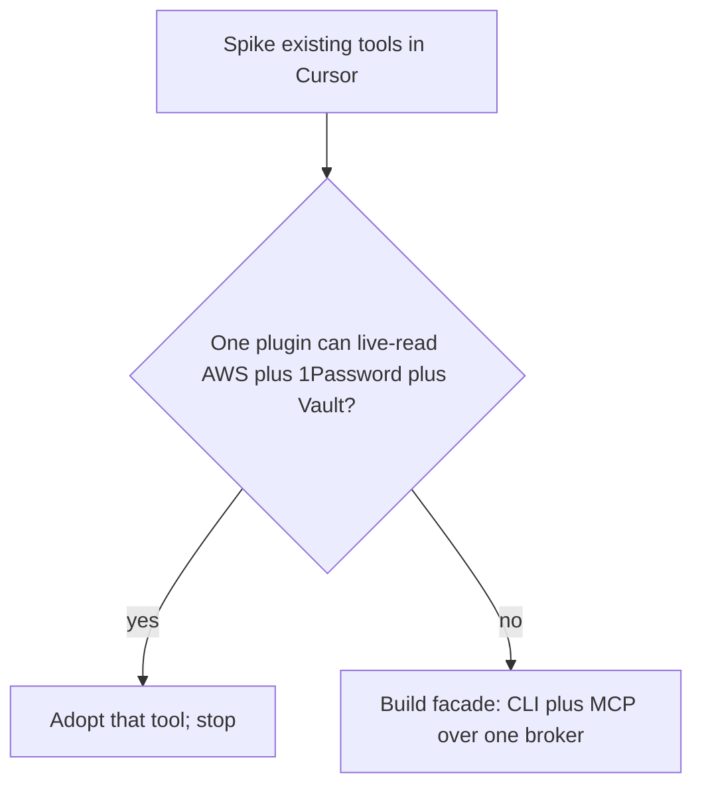

# Plan: Try existing tools first

**Status:** done (spike)  
**Decision gate:** only build `secret-broker` if no federated front-end already exists.

## Thesis

The architecture in `001` is right, but the product category already exists. Building another encrypted local vault would duplicate 2026 tools. The only gap worth building is a **federated adapter** in front of stores that are already the source of truth.

## Closest matches (do not reimplement)

| Tool | Fit | Gap |
| --- | --- | --- |
| **ClauLock** | MCP + `execve` placeholder rewrite; never-reveal | Own vault `~/.clsec/`; not AWS/Vault/1P backends |
| **AgentSecrets** | MCP `api_call` / `list_secrets`, proxy, allowlists, redaction, no `get()` | Docs claim AWS-as-SoT delivery — **verify in spike**; stores in OS keychain |
| **AWS `asm-exec`** | `{{resolve:secretsmanager:…}}` + hook blocks `GetSecretValue` | AWS-only; best-effort, not a security boundary |
| **1Password `op run`** | Inject into child | 1P-only |
| **Doppler / Infisical / Keeper** | Prefer `run`/`exec` wrappers | Avoid MCP servers that dump values |
| HashiCorp Vault MCP | Has `read_secret` | **Wrong threat model** |

Complementary: `mcp-secrets-runner` injects into *other* MCP servers at startup — useful alongside a broker, not an agent-facing API.

## Spike checklist

1. Install ClauLock and AgentSecrets as Cursor MCP servers; confirm list + authenticated call with no value in transcript.
2. Prompt-inject off-allowlist host; confirm deny.
3. Check AgentSecrets AWS/Vault/1Password resolution with secrets that stay in the original store (**no copy-in**). If yes → **adopt; stop**.
4. Separately try `op run` and `asm-exec`. Two CLIs + a Cursor rule may be enough.
5. Score CLIs against the `secret-broker` command set (`list`, `call`, `run`, `policy`, `audit`, `doctor`). Missing MCP is easier to wrap than a missing CLI.

## Decision tree

## Spike outcome (recorded in `SPIKE.md`)

- AgentSecrets AWS federation claim is **docs-only**; source resolves from OS keychain after copy-in.
- No existing tool is a multi-store never-reveal front-end.
- **Proceed to build facade** (`003`).
